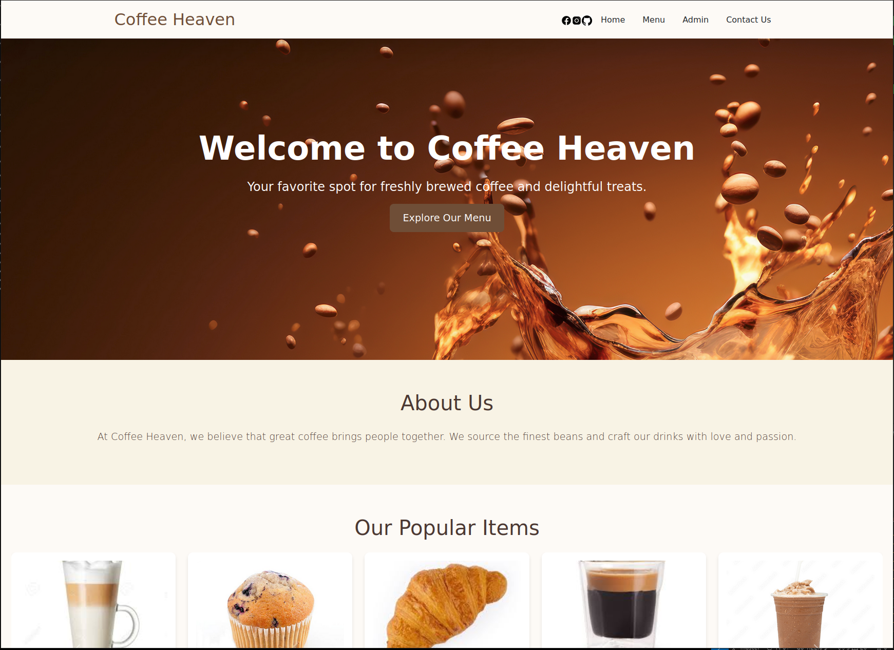
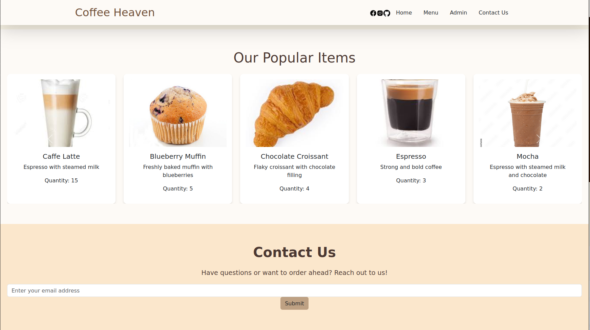
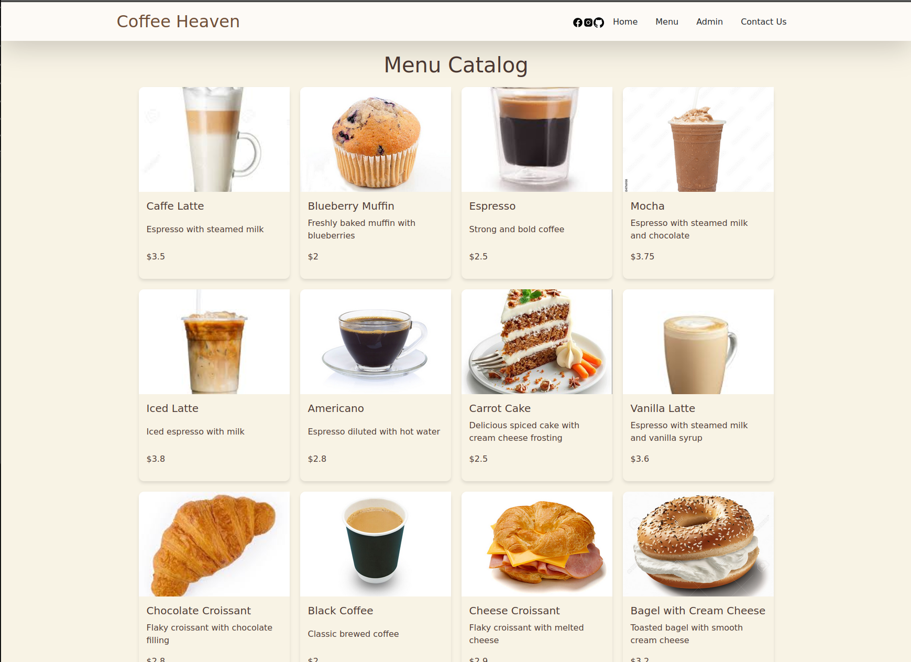

# ☕ **Frappuchino - The Ultimate Coffee Shop Management System** 💖

Ever wondered how your favorite coffee shop juggles a rush of orders, ensures they always have your favorite blend ready, and remembers your special coffee preferences? Behind the scenes, they rely on smart management systems to keep everything running smoothly. ☕💻

Introducing **Frappuchino** — a simplified version of these systems! It’s your chance to dive into the technology behind the coffee counter. With **Frappuchino**, you’ll be able to handle orders, manage inventory, and keep the menu up to date, just like a real coffee shop manager. Let’s make the coffee shop world even better with some cool tech! 💡

---

## ✨ Key Features of Frappuchino:

- **Manage Orders:** Create, update, close, and delete customer orders with ease. You’ve got this! 👨‍🍳✨
- **Oversee Inventory:** Keep track of stock levels to prevent shortages and ensure every cup is fresh and perfect. 📦
- **Update the Menu:** Add new drinks, update prices, or add delicious new pastries to your offerings. 🍰☕
  
So, whether you’re brewing up a batch of lattes or tracking down that last packet of sugar, **Frappuchino** helps you handle it all in style! 🎉

---

## 📸 **Visuals**

- **Home Page:**  


- **Popular Items:**  


- **Menu Catalog:**  


## 🌟 API Endpoints

### **Orders**

| Method | Endpoint            | Description                         | Response                     |
|--------|---------------------|-------------------------------------|------------------------------|
| POST   | `/orders`           | Creates a new order.               | 🎉 201 Created               |
| GET    | `/orders`           | Retrieves all orders.              | 😎 200 OK                    |
| GET    | `/orders/{id}`      | Retrieves a specific order by ID.  | 😄 200 OK                    |
| PUT    | `/orders/{id}`      | Updates an existing order.         | ✨ 200 OK                    |
| DELETE | `/orders/{id}`      | Deletes an order.                  | 💥 204 No Content           |
| POST   | `/orders/{id}/close` | Closes an open order.             | 💫 200 OK                    |

---

### **Menu Items**

| Method | Endpoint            | Description                         | Response                     |
|--------|---------------------|-------------------------------------|------------------------------|
| POST   | `/menu`             | Adds a new menu item.              | 🍰 201 Created               |
| GET    | `/menu`             | Retrieves all menu items.          | 📜 200 OK                    |
| GET    | `/menu/{id}`        | Retrieves a specific menu item.    | 🍽️ 200 OK                    |
| GET    | `/menu/{id}/image`  | Retrieves a menu item's image.     | 🍽️ 200 OK                    |
| PUT    | `/menu/{id}`        | Updates an existing menu item.     | ✨ 200 OK                    |
| PUT    | `/menu/{id}/image`  | Updates an existing menu item's image.| ✨ 200 OK                    |
| DELETE | `/menu/{id}`        | Deletes a menu item.               | 💥 204 No Content           |
---

### **Inventory**

| Method | Endpoint            | Description                         | Response                     |
|--------|---------------------|-------------------------------------|------------------------------|
| POST   | `/inventory`        | Adds a new inventory item.         | 🎉 201 Created               |
| GET    | `/inventory`        | Retrieves all inventory items.     | 💡 200 OK                    |
| GET    | `/inventory/{id}`   | Retrieves a specific inventory item. | 📦 200 OK                   |
| PUT    | `/inventory/{id}`   | Updates an inventory item.         | ✨ 200 OK                    |
| DELETE | `/inventory/{id}`   | Deletes an inventory item.         | 💥 204 No Content           |

---

### **Reports and Aggregations**  

| Method | Endpoint                  | Description                       | Response                     |
|--------|---------------------------|-----------------------------------|------------------------------|
| GET    | `/reports/total-sales`    | Retrieves total sales amount.     | 💰 200 OK                    |
| GET    | `/reports/popular-items`  | Retrieves a list of popular menu items. | 📊 200 OK                |

---

## 💌 Request Examples

### **Create/Update Order Request:**
```http
POST /orders
Content-Type: application/json

{
    "customer_name": "Tyler Derden",
    "items": [
        {
            "product_id": "latte",
            "quantity": 2
        },
        {
            "product_id": "muffin",
            "quantity": 1
        }
    ]
}
```

### **Add/Update Menu Item Request:**
```http
POST /menu
Content-Type: application/json

{
    "product_id": "latte",
    "name": "Caffe Latte",
    "description": "Espresso with steamed milk",
    "price": 3.5,
    "ingredients": [
        {
            "ingredient_id": "espresso_shot",
            "quantity": 1
        },
        {
            "ingredient_id": "milk",
            "quantity": 200
        }
    ]
}
```

### **Add/Update Inventory Item Request:**
```http
POST /inventory
Content-Type: application/json

{
    "ingredient_id": "espresso_shot",
    "name": "Espresso Shot",
    "quantity": 490,
    "unit": "shots"
}
```

---

### **Total Sales Aggregation Response:**
```http
HTTP/1.1 200 OK
Content-Type: application/json

{
  "total_sales": 29
}
```

---

## 🚀 How to Run

To get **Frappuchino** up and running locally with Docker, follow these steps:

1. Make sure you have **Docker** installed on your machine.
2. Clone the repository to your local machine.
3. Open a terminal and navigate to the project folder.
4. Run the following command to build and start the application:

```bash
docker-compose up --build
```

This will set up all the necessary containers and get the app running on your local machine.

---

## 🏅 Authors:

This project has been brought to you with love by:
- **mboranba** 💻
- **azhalgas** 🌟

---